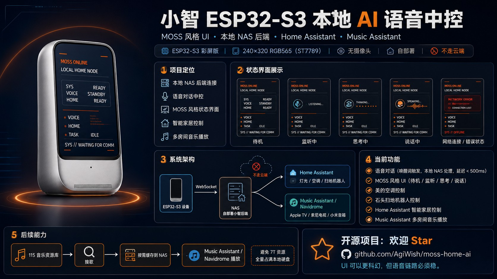

# MOSS Home AI

> 小智 ESP32-S3 本地 AI 语音中控 — MOSS 风格 UI · 本地 NAS 后端 · Home Assistant · Music Assistant



[](https://github.com/AgiWish/moss-home-ai)
[](https://github.com/AgiWish/moss-home-ai)
[](https://github.com/AgiWish/moss-home-ai)
[](https://github.com/AgiWish/moss-home-ai)

---

## 项目定位

用 ESP32-S3 彩屏设备打造一个**完全本地化**的 AI 语音中控终端：

- 语音对话通过本地 NAS 上自部署的小智后端处理，**延迟 < 500ms**，不走任何外部云端
- UI 采用 MOSS 风格（待机 / 监听 / 思考 / 说话 四状态切换）
- 打通 Home Assistant 控制全屋设备（灯光 / 空调 / 扫地机器人 / 窗帘）
- 通过 Music Assistant 实现多房间音乐播放（Apple TV / 索尼电视 / 小米音箱）

---

## 系统架构

```
ESP32-S3 设备
    │  WebSocket
    ▼
NAS 自部署小智后端
    ├──▶ Home Assistant   灯光 / 空调 / 扫地机器人
    └──▶ Music Assistant  Apple TV / 索尼电视 / 小米音箱
         Navidrome        115 音乐资源库
```

**核心原则：不走云端。** 语音识别、大模型对话、设备控制全链路在局域网内闭环。

---

## 当前功能

| 功能 | 状态 | 说明 |
|------|------|------|
| 语音对话 | ✅ | 唤醒触发，本地 NAS 处理，延迟 < 500ms |
| MOSS 风格 UI | ✅ | 待机 / 监听 / 思考 / 说话四状态 |
| 美的空调控制 | ✅ | 温度、模式、开关 |
| 石头扫地机器人 | ✅ | 开始清扫 / 回充 |
| 智能家居控制 | ✅ | 灯光 / 窗帘（open/close/stop）|
| 多房间音乐播放 | ✅ | Music Assistant，115 资源库 |
| 网络断线检测 | ✅ | 屏幕显示 NETWORK ERROR / SYS OFFLINE |

---

## 硬件配置

| 项目 | 规格 |
|------|------|
| 主控 | ESP32-S3-N16R8 |
| 屏幕 | 240×320 RGB565（ST7789）彩屏版 |
| 摄像头 | 无 |
| 部署方式 | 自部署，不走云端 |

---

## 目录结构

```
moss-home-ai/
├── README.md
├── assets/
│   └── product-overview.png       # 产品总览图
├── firmware/
│   └── xiaozhi-esp32/             # ESP32-S3 固件源码副本
├── backend-patches/
│   ├── hass_play_music.py         # NAS 后端音乐控制插件
│   └── hass_set_state.py          # NAS 后端 HA 控制插件
└── docs/
    ├── 00-current-state.md        # 当前真实状态快照
    ├── 01-architecture.md         # 整体架构
    ├── 02-firmware.md             # 固件源码、烧录、UI 逻辑
    ├── 03-nas-backend.md          # NAS 后端、Docker、日志、插件
    ├── 04-home-assistant.md       # HA 设备实体与控制规则
    ├── 05-music-tv.md             # 音乐、Apple TV、电视
    ├── 06-known-issues.md         # 已知问题与处理记录
    ├── 07-next-steps.md           # 下一步待办
    └── 08-moss-ui-audit.md        # MOSS UI 落地审查
```

---

## 快速上手（复现环境）

### 1. NAS 后端

```bash
ssh -p 223 root@192.168.5.8
cd /volume1/docker/xiaozhi-server
docker compose restart xiaozhi-esp32-server
```

查看运行日志：

```bash
docker logs --since=20m xiaozhi-esp32-server 2>&1 | \
  grep -E '识别文本|大模型收到|执行工具|hass_set_state|hass_play_music|失败|返回|播放音乐'
```

### 2. 设备固件

参考 `docs/02-firmware.md`，当前使用 `xiaozhi-esp32-main203` 彩屏固件，烧录后配置指向本地 NAS 后端地址。

### 3. 插件补丁

```bash
# 将 backend-patches/ 中的文件复制到 NAS
cp backend-patches/hass_play_music.py  /volume1/docker/xiaozhi-server/patches/
cp backend-patches/hass_set_state.py   /volume1/docker/xiaozhi-server/patches/
```

---

## 关键地址

| 服务 | 地址 |
|------|------|
| Home Assistant | `http://192.168.5.8:8123` |
| Music Assistant | `http://192.168.5.8:8096` |
| Apple TV MA player id | `apfeb2842e85f8` |

---

## 后续计划

- [ ] MOSS UI 完整独立主题实现（见 `docs/08-moss-ui-audit.md`）
- [ ] 115 音乐资源库搜索 → 按需缓存到 NAS → Navidrome 播放（避免 7T 全量占满本地硬盘）
- [ ] 多设备联动场景（离家模式 / 回家模式）

---

*UI 可以更科幻，但语音链路必须稳。*
